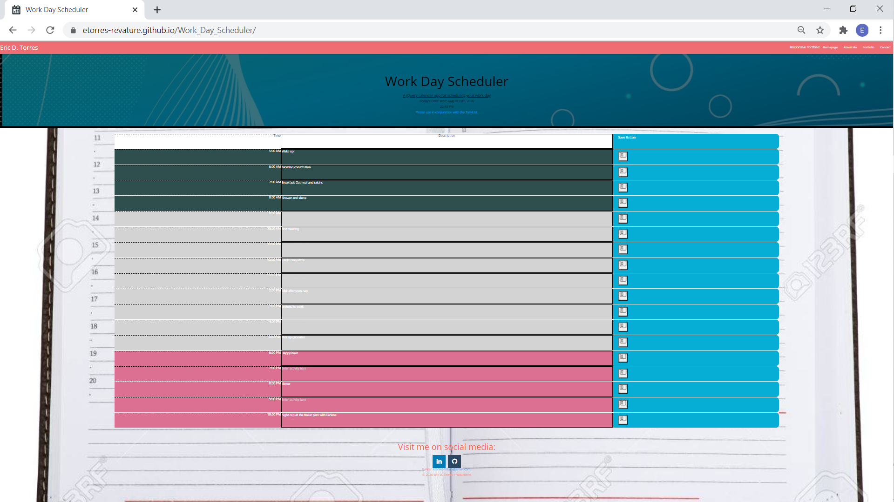

# :calendar: [Work_Day_Scheduler](https://etorres-revature.github.io/Work_Day_Scheduler/) :calendar:

> Time is a funny thing; it is never as long as it has seemed - Anon

Every day we make choices about how to spend our time.  Sometimes we commit to social engagements with our friends.  Other times, our work may create commitments that cannot be missed.  Weddings, court dates, coffe klatches, job interviews, pickup basketball, budget meetings, the litany of potential activities can quickly become overwhelming.  

This [Work_Day_Scheduler](https://etorres-revature.github.io/Work_Day_Scheduler/) is the perfect app to keep track of all your events.

> Time waits for no one - Folklore*

The work day scheduler has three columns and 18 rows representing time from 5:00 AM to 10:00 PM.  The left-hand column represents the time of the associated event.  The middle column is for entering the details/descripton of each event.  The right-hand row contains the button to save the appointment.

> Lost Time is never found again - Benjamin Franklin*

The middle column is a textarea where event details can be entered.  Once entered, the save button will persist the information entered into local storage.  Time, details, and a timestamp are created in JavaScript as an array of objects and stringified for local storage.  The local storage string is parsed to JSON to render each appointment into its appropriate time slot.  

Additionally, there is a clear data funciton that uses the timestamp to determine whether or not appointment entries are more than one day old.  If the entry is older than one day, then it is removed from local storage. 

> The key is in not spending time, but in investing it - Stephen R. Covey*

Finally, timeblocks are color coded.  

* Morning hours have been assigned a background of 
Dark Slate Gray
.  

### :computer: Technologies Used :computer:

#### :memo: HTML5 :memo:

**HTML 5** is a markup language used for structuring and presenting content on the World Wide Web.  The goals are to improve the language with support for the latest multimedia and other new features; to keep the language both easily readable by humans and consistently understood by computers and devices; and to remain backward compatible to older software.  Many new symantic features are included.

*HTML5* content borrowed from <a target="_blank" rel="noopener noreferrer">[this page](https://en.wikipedia.org/wiki/HTML5).</a>

#### :art: CSS :art:

**Cascading Style Sheets (CSS)** is a stylesheet language used for describing the presentation of a document written in a markup language (such as HTML5).  CSS is designed to enable the separation of presentation and content; including layout, colors, and fonts.  This separation improves content accessibility to provide more flexibility and control in the secification of presentation characteristics, enabling multiple web pages to share formatting by specifying relevant CSS in a separate file, which reduces complexity and repetition in the structural content (HTML) as well as enabling the file to be cached to improve the page load speed between the pages that share the file and its formatting.

Separation of formating and content also makes it feasible to present the same markup page in different styles for different rendering methods, such as on-screen, in print, by voice, and on Braille-based tactile devices. 

*CSS* content borrowed from <a target="_blank" rel="noopener noreferrer">[this page](https://en.wikipedia.org/wiki/Cascading_Style_Sheets).</a>

#### :shoe: Bootstrap 4 :shoe:

**Bootstrtap 4** is a free and open-source CSS framework directed at responsive, mobile-first front-end web development.  It contains CSS and (optionally) JavaScript-based design templates for typography, forms, buttons, navigation, and other interface components.  

*Bootstrap 4* content borrowed from <a target="_blank" rel="noopener noreferrer">[this page](https://en.wikipedia.org/wiki/Bootstrap_(front-end_framework)).</a>

#### :page_with_curl: MaterializeCSS :page_with_curl:

**MaterializeCSS** combines the classic principles of successful design along with innovation and technology. The goal is to develop a system of design that allows for a unified user experience across all their products on any platform.

Elements and components such as grids, typography, color, and imagery are not only visually pleasing, but also create a sense of hierarchy, meaning, and focus. 

*Materialize* content borrowed from <a target="_blank" rel="noopener noreferrer">[this page](https://materializecss.com/about.html).</a>

#### :sparkler: JavaScript :sparkler:

**JavaScript (JS)** is one of the core technologies of the World Wide Web (along with HTML and CSS). It enables interactive web pages and is an essential part of web applications.  JS is a multi-faceted, scripting language that provides versatility through Application Programming Interfaces (APIs) and Document Object Model (DOM) manipulation, among others.

*JavaScript* content borrowed from <a target="_blank" rel="noopener noreferrer">[this page](https://en.wikipedia.org/wiki/JavaScript).</a>

#### :hourglass: Moment.js :hourglass:

**Moment.js** is a free and open source JavaScript library that removes the need to use the native Date object directly.  The library is a wrapper for the Date object making it easier to use.  Moment.js extends date capabilities with a variety of features, such as relative time, calendar time, durations, and multi-language support.  

*Moment.js* content borrowed from <a target="_blank" rel="noopener noreferrer">[this page](https://www.webfx.com/blog/web-design/javascript-dates-moment-js/).

## Author :sunglasses:

Content and design created by :green_heart: Eric D. Torres :green_heart:.  

The author can be reached at etorresnotary@gmail.com. 

###### License

This product is unlicensed.

*Quotes about time from [HERE](https://www.actitime.com/time-management/best-time-quotes/).